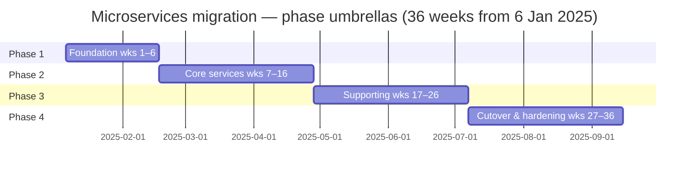

# Project Timeline: Monolith → Microservices Migration

## Timeline Overview

- **Start:** 6 Jan 2025 (Mon, week 1)
- **End:** 26 Sep 2025 (target — 1 week earlier than the 30 Sep contractual date)
- **Duration:** 9 months / **36 weeks** / **18 sprints (2-week cadence)**
- **Team:** 6 engineers (≈4.8 FTE — see capacity plan)
- **Hard constraints:** Black Friday freeze 1–30 Nov, two engineers at 50%, shared test environments

The plan is built around four phases. Cadence is 2-week sprints; phase boundaries are sprint boundaries — no “half sprint” gates. Buffer is allocated per phase and held centrally; teams cannot draw against another phase’s buffer without Tech Lead sign-off.

---

## Phase 1 — Foundation (Weeks 1–6 / Sprints 1–3)

**Theme:** Stand up infrastructure, ship the first non-revenue service end-to-end, prove the migration pattern is real.

**Milestones**

| Week | ID    | Milestone                                            | Deliverable                                                          | Owner       |
|------|-------|------------------------------------------------------|----------------------------------------------------------------------|-------------|
| 2    | M1.1  | K8s cluster + namespacing live                       | Dev/staging clusters, RBAC, secrets baseline                          | Senior 1    |
| 3    | M1.2  | CI/CD template for microservices                     | One golden Pipelines template, blue/green deploy, ephemeral PR envs   | Senior 1    |
| 4    | M1.3  | Observability baseline                               | OpenTelemetry SDK, dashboards-as-code, on-call runbook template       | Senior 2    |
| 5    | M1.4  | **Auth Service in production** (lowest risk slice)   | 100% of auth traffic, dual-read fallback to monolith                  | Senior 3    |
| 6    | M1.5  | Phase 1 demo + go/no-go for Phase 2                  | Stakeholder review, signed exit criteria                              | Tech Lead   |

**Dependencies (must finish in this order)**

1. K8s cluster → CI/CD template
2. CI/CD template → first service deploy
3. Observability stack → first service in production (no go-live without traces and SLOs)
4. Cluster security review → external traffic to any service

**Risks (cross-ref to risk register)**

- R6 — Knowledge gaps on K8s/observability (active mitigation: pairing schedule)
- R7 — Test environment capacity (active mitigation: ephemeral PR envs delivered in week 4)

**Exit criteria — all must be ticked or Phase 2 doesn’t start**

- [ ] K8s cluster meets infra security review.
- [ ] CI/CD template used by ≥2 services in dev.
- [ ] Auth service serving 100% of auth traffic for 7 consecutive days.
- [ ] p95 latency on Auth ≤ baseline + 20%.
- [ ] Runbook + on-call rota in place; two-person rule active.
- [ ] Phase 1 demo signed off by VP Eng + Product Director.

---

## Phase 2 — Core Services (Weeks 7–16 / Sprints 4–8)

**Theme:** Extract the revenue-critical services — the part where decomposition gets real.

**Services delivered in this phase**

1. **User Service** — weeks 7–9
2. **Product Service** — weeks 9–12 (1-week overlap on tail end of User)
3. **Order Service** — weeks 12–16 (the big one — saga design lives here)

**Milestones**

| Week | ID    | Milestone                                                | Deliverable                                                       | Owner       |
|------|-------|----------------------------------------------------------|-------------------------------------------------------------------|-------------|
| 9    | M2.1  | User Service in production                               | 100% read/write, monolith reads soft-deprecated                   | Senior 3    |
| 10   | M2.2  | Saga design ratified                                     | ADR for orchestration pattern, idempotency keys, compensations    | Tech Lead   |
| 12   | M2.3  | Product Service in production                            | 100% reads from new service, writes still dual                    | Senior 1    |
| 14   | M2.4  | Order Service alpha — internal traffic only              | Internal callers migrated, no customer traffic yet                | Senior 1    |
| 16   | M2.5  | Order Service in production at 100%                      | All checkout paths through new service, monolith order code frozen| Tech Lead   |

**Dependencies**

- User Service must be live before Order (Order references user IDs and entitlements).
- Saga design must land before Order writes go cross-service.
- Reconciliation job (R1 mitigation) must be live before any write traffic shifts.
- Product → Order coupling: cannot fully cut Order until Product can serve catalog data at p95 ≤ 120ms.

**Risks active in this phase**

- R1 — Data consistency (very active during dual-run windows)
- R3 — Distributed transactions (Order/Product interaction)
- R4 — Performance regression (network hops add up)
- R8 — Rollback complexity on schema changes

**Exit criteria**

- [ ] User, Product, Order all serving 100% production traffic for 14 consecutive days.
- [ ] Reconciliation jobs green (drift < 0.05%) for 7 consecutive days per service.
- [ ] Saga compensation rate < 0.5% on checkout path.
- [ ] No open Sev-1 / Sev-2 incidents on migrated services.

---

## Phase 3 — Supporting Services (Weeks 17–26 / Sprints 9–13)

**Theme:** Extract the remaining services and harden the platform before cutover.

**Services delivered in this phase**

1. **Payment Service** — weeks 17–20
2. **Notification Service** — weeks 19–21 (parallel-able, low coupling)
3. **Inventory Service** — weeks 21–24
4. **Search Service** — weeks 23–26 (read-mostly, lower risk, scheduled last as a buffer slot)

**Milestones**

| Week | ID    | Milestone                                                | Deliverable                                                  | Owner       |
|------|-------|----------------------------------------------------------|--------------------------------------------------------------|-------------|
| 20   | M3.1  | Payment Service in production                            | 100% traffic, PCI scope review signed                        | Senior 1    |
| 21   | M3.2  | Notification Service in production                       | All transactional notifications via new service              | Mid 1       |
| 24   | M3.3  | Inventory Service in production                          | Dual-write consolidated; reservation flow on new service     | Senior 3    |
| 26   | M3.4  | Search Service in production + Phase 3 demo              | All 8 services live; cutover plan signed for Phase 4         | Tech Lead   |

**Dependencies**

- Payment depends on Order saga being stable.
- Notification depends on User Service (notification preferences).
- Inventory depends on Product (SKU model).
- PCI/security review (external) must be booked in week 14 to land before week 20 — this is a long-lead item.

**Risks active**

- R2 — BF freeze pressure starts to bite from week 22.
- R3 — Saga complexity (Payment closes the loop).
- R4 — Performance regression (Search is latency-sensitive).

**Exit criteria**

- [ ] All 8 services in production at 100% traffic.
- [ ] Reconciliation green across all services for 14 consecutive days.
- [ ] Performance budgets met per service (see baseline doc).
- [ ] Cutover (decommission) runbook reviewed and signed off by VP Eng.
- [ ] All Phase 4 work scheduled to land **before 24 Oct** (1-week safety margin to BF freeze).

---

## Phase 4 — Cutover, Decommission, Hardening (Weeks 27–36 / Sprints 14–18)

**Theme:** Decommission monolith code paths, complete hand-off, ride out the freeze, finalise documentation.

**Calendar shape (deliberately bent around the freeze)**

- **Weeks 27–30 (Jul-Aug):** Decommission monolith write paths service-by-service.
- **Weeks 31–32 (Sep wk 1–2):** Final hardening sprint — security, load, DR drill.
- **Weeks 33–34 (Sep wk 3–4):** Documentation, knowledge transfer to support, post-launch monitoring setup, project close.
- **Weeks 35–36 / freeze window (Nov):** Reserved as **freeze buffer / BAU support** — no migration deploys. Used to absorb any slip from earlier phases.

**Milestones**

| Week | ID    | Milestone                                                  | Deliverable                                          | Owner       |
|------|-------|------------------------------------------------------------|------------------------------------------------------|-------------|
| 30   | M4.1  | Monolith write paths decommissioned                        | Code removed for all 8 service domains               | Tech Lead   |
| 32   | M4.2  | Hardening sprint complete                                  | Pen test, load test, DR drill, security sign-off     | Senior 2    |
| 34   | M4.3  | Project handoff                                            | Runbooks, SLOs, on-call rota signed by Support       | Tech Lead   |
| 35–36| —     | **BF freeze window — no deploys**                          | BAU operate-only; team rotates onto stabilisation    | Tech Lead   |

**Dependencies**

- All cutovers complete before 24 Oct (R2 mitigation).
- Security review and pen test booked in week 24 (long-lead).
- Support team training booked in week 30.

**Risks active**

- R2 — BF freeze (now in the window).
- R5 — Team capacity (people will take leave; plan accordingly).
- R8 — Rollback complexity (last writes on the monolith are the most dangerous).

**Exit criteria**

- [ ] No monolith write paths remain for the 8 migrated domains.
- [ ] All runbooks signed by Support and on-call.
- [ ] DR drill completed end-to-end.
- [ ] Project retrospective held; lessons captured in `docs/postmortems/`.

---

## Critical Path

```
M1.1 K8s (2w) → M1.2 CI/CD (1w) → M1.4 Auth (2w) →
M2.1 User (3w) → M2.3 Product (3w) → M2.5 Order (4w) →
M3.1 Payment (4w) → M3.3 Inventory (4w) →
M4.1 Decommission (4w) → M4.2 Hardening (2w) → M4.3 Handoff (2w)
```

- **Critical path duration (no buffer):** 31 weeks
- **With phase + integration + final buffer:** 36 weeks
- **Critical path “owners” (single points of slip):** Auth (Senior 3), Order (Senior 1 + Tech Lead), Payment (Senior 1)
- **Notification, Search, parts of Inventory** sit *off* the critical path — these are the candidates for descope or deferral if R5 (capacity) materialises.

---

## Buffer Allocation

| Buffer type            | Allocation                  | Purpose                                              |
|------------------------|-----------------------------|------------------------------------------------------|
| Phase buffer           | 1 sprint per phase × 4      | Unknown unknowns — held by Tech Lead, not the team   |
| Integration buffer     | ~0.5 week per service × 8   | Cross-service / contract work, env contention        |
| Final hardening buffer | 2 weeks pre-cutover         | Pen test fixes, load test surprises, DR drill        |
| Freeze buffer          | 4 weeks (Nov)               | The whole BF freeze window — slip absorber, not slack|
| **Total**              | **~12 weeks**               | **~33% of timeline** — high but defensible for 99.9% uptime migration |

**Buffer rules**

- Buffer is held by the Tech Lead, not assigned per engineer.
- Buffer burndown is tracked weekly. If we’re past 50% of project time and have used >50% of buffer, that itself is an Amber trigger.
- Buffer is *never* exposed to external stakeholders as “slack we could fill with extra scope” (per the principle from the lecture). Internally it is transparent; externally we communicate the planned end date.

---

## Key Dates

| Date           | Event                                | Implication                                          |
|----------------|--------------------------------------|------------------------------------------------------|
| 6 Jan 2025     | Project kickoff (M0)                 | Sprint 1 begins, environments stood up               |
| 14 Feb 2025    | Phase 1 exit gate                    | Go/no-go on Phase 2 — strict criteria, not soft date |
| 25 Apr 2025    | Phase 2 exit                         | Core revenue services live; biggest single risk closed |
| 4 Jul 2025     | Phase 3 exit                         | All 8 services live                                  |
| 24 Oct 2025    | **Last cutover deadline**            | Anything after this date defers past freeze         |
| 1–30 Nov 2025  | **Black Friday freeze**              | No production deploys                                |
| 26 Sep 2025    | Project end (target)                 | 1 week ahead of 30 Sep contractual date             |
| 30 Sep 2025    | Project end (contractual)            | The number we share externally                       |

---

## Visual — phase / service timeline

**Preview gotcha:** A wide ASCII “Gantt” inside a fenced code block looks fine in Notepad or a fixed-width terminal, but **Markdown previews usually soft-wrap long lines.** When that happens, `[====]` jumps to the **start** of a new wrapped line — so Phase 4 can look like it lines up under week 1 while Hardening/Handoff/Freeze look clustered at weeks 1–3. That layout is misleading; it comes from wrapping, not from the plan itself.

Below is the **canonical** timeline (readable in PDF, Cursor, Teams, GitHub — same data as Azure Boards).

### Week span table (canonical)

| Phase | Workstream | Weeks (calendar, inclusive) | Sprints |
|-------|-------------|------------------------------|---------|
| **1 Foundation** | *Phase umbrella* | 1–6 | 1–3 |
| | K8s / infra | 2–4 | 1–2 |
| | CI/CD golden path | 3–5 | 2–3 |
| | Observability baseline | 4–6 | 2–3 |
| | Auth service go-live | 5–6 | 3 |
| **2 Core services** | *Phase umbrella* | 7–16 | 4–8 |
| | User service | 7–9 | 4–5 |
| | Product service | 9–12 | 5–6 |
| | Order service | 12–16 | 7–8 |
| **3 Supporting services** | *Phase umbrella* | 17–26 | 9–13 |
| | Payment service | 17–20 | 9–10 |
| | Notification service | 19–21 | 10–11 |
| | Inventory service | 21–24 | 11–12 |
| | Search service | 23–26 | 12–13 |
| **4 Cutover & hardening** | *Phase umbrella* | 27–36 | 14–18 |
| | Monolith decommission | 27–30 | 14–15 |
| | Hardening (pen/load/DR) | 31–32 | 16 |
| | Handoff / project close | 33–34 | 17 |
| | BF freeze — no prod deploy | 35–36 | 18 |

*System of record for deliverables:* Azure DevOps timelines / boards; keep this markdown table synced when dates shift after planning.

### Optional — Mermaid (GitHub renders this; Cursor may depend on Markdown preview extensions)

Use this where Mermaid works; skip it otherwise — the **week span table** is the source of truth for individual workstreams. The diagram below is **phase umbrellas only** (four contiguous blocks = 36 weeks × 7 days).



Overlaps between Payment / Notification / Inventory / Search are shown only in the **table** above, not duplicated here — avoids calendar drift between “week numbering” and Mermaid bars.

---

## How this plan handles the things that usually break timelines

- **Optimistic estimates** — phases sized in 3-sprint blocks with explicit buffer; we communicate the planned-with-buffer date externally, never the optimistic one.
- **Ignored dependencies** — long-lead externals (security review, PCI, infra requests) are booked in Sprint 1 and tracked as their own work items.
- **Zero buffer** — 33% buffer total, held centrally, defended.
- **Silent failure** — Amber triggers defined per phase exit, weekly RAG report, escalation protocol per stakeholder plan.
- **Estimation by seniority** — every estimate goes through planning poker with the whole team; the seniors do not estimate for the juniors.
